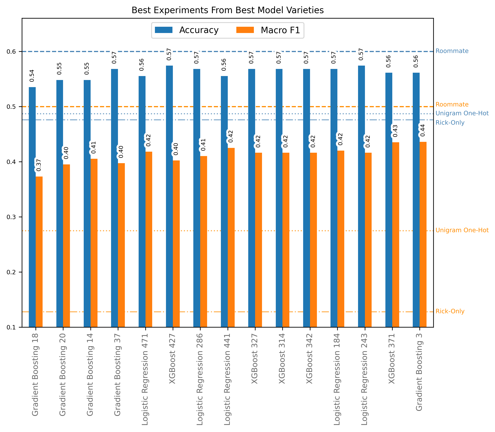

# Rick & Morty Speaker Identification

A journey in text classification.

(Fulfilling project requirements for COSI114a at Brandeis University, which prohibits using contextual embeddings and neural classifiers)

**TLDR**:

Classifying the speaker of an isolated Rick & Morty utterance is a difficult task. For example, my roommate, a die-hard Rick & Morty fan, was only 60% accurate when presented with a shuffled random sample of 80 instances. Furthermore, with only 11 episodes-worth of data, it was very hard not to overfit to the specific quirks of the episodes (E.g. tokens associated with one-off, character-specific side quests). Nevertheless, introducing the custom, word-embedding-based feature _"Neighborhood Degrees of Presence"_, as well as restricting unigram-based features to only familial words and common names proved to be the crucial moments that pushed performance to near-human level.

**Key Files**:

```python
📁
├─ 📁 src/
│  ├─ 📄 config.py  # Experimentation configurations
│  ├─ 📄 feature_extractors.py  # Feature extraction functions
│  ...
├─ 📄 run_experiments.py  # Script to run experimentation
...
```

## The Task at Hand

With nothing but an _isolated_ utterance from the TV show Rick and Morty, can we detect who the speaker was? Take the following utterance for example:

> _"Shut up, Jerry."_

Knowing nothing else about the utterance (e.g. the context in which it was said), can you guess who said it?

...

If you guessed Beth, you'd be correct! (Season 2, Episode 5). But don't worry, I didn't either...

The point is... this is a hard task... perhaps, in many cases, impossible. Before we try and get a computer to do it, we need to relativize our expectations.

## Roommate Benchmark

After pulling [this](https://huggingface.co/datasets/ysharma/rickandmorty) dataset, filtering it to just the Sanchez/Smith family members, and splitting it into train/dev/test sets, I randomly sampled 80 utterances from the dev set, shuffled them, and asked my roomate (who "loves" Rick & Morty) to guess their speakers.

Here are his results:

| Accuracy | Macro F1 |
| --- | --- |
| .60 | .50 |

## The Data Was Slim Pickin'

Unfortunately, the difficulty of the task wasn't the only daunting obstacle... Our dataset only contained transcriptions from 11 episodes. Yikes! My roommate has seen way more than that!

After fitting a few preliminary models, it was clear that we were having serious problems overfitting to the specifics of the episodes. For example, when using tree-based models (that produce feature importance metrics), one of the recurring important features was the presence of the word "vindicators". If you're familiar with the show, you know that the this is a highly episode-specific reference that would not generalize well to other episodes.

## Familial Words & Common Names

To combat this, I made a quick list of familial words and common names and restricted my unigrams to only these.

```python
FAMILIAL_WORDS_AND_COMMON_NAMES = {
    "birdperson",
    "tammy",
    "gearhead",
    "jessica",
    "rick",
    "morty",
    "summer",
    "beth",
    "jerry",
    "wong",
    "smith",
    "sanchez",
    "sanchezes",
    "smiths",
    "father",
    "mother",
    "dad",
    "mom",
    "son",
    "daughter",
    "brother",
    "sister",
    "grandfather",
    "grandpa",
    "grandma",
    "mom",
    "dad",
    "sis",
    "bro",
    "grandmother",
    "grandson",
    "granddaughter",
    "jesus",
    "christ",
    "um",
    "uh",
    "married",
    "grampa",
    "honey",
    "you",
    "i",
    "me",
    "our",
    "your",
    "we",
    "my",
    "parent",
    "parents",
    "wife",
    "husband",
}
```

The basic idea here is that these words would be both highly common across all episodes as well as highly indicative of the speaker.

Doing this noticably improved performance, demonstrating both that we were on the right track, and that further fruitful feature engineering would likely be characterized by generalizability.

## Neighborhood Degrees of Presence

With this discovery as a precedent, I knew I needed to engineer a generalizable way to capture the quintessence of each character's speech patterns as features. Although predicting based of the presence of these specific tokens improved performance, relying on this alone produced a very underwhelming model where utterances that lacked these words would effectively carry no predictive information.

To solve this, I created a custom feature extraction strategy that I called _"Neighborhood Degrees of Presence"_.

The strategy is as follows:

1. **Setup** (identify important "neighborhoods")

    - For each non-stop-word token in the training data, use a pretrained word-embedding model to get the mean embedding for the token and its $N_\text{nghbrs}$ nearest neighbors in the model vocabulary.

        (where $N_\text{nghbrs}$ is a hyperparameter)

2. **Feature Extraction** (calculate the "degree" to which each semantic "neighborhood" "is present" in the utterance)

    - For each previously identified semantic "neighborhood", calculate its cosine similarity to the mean embedding of the $N_\text{compare}$ most similar embedded tokens from the utterance.

        (where $N_\text{compare}$ is a hyperparameter)

Adding this new strategy to our pipeline improved performance even further, and, crucially, it was generalizable to words that were not in the training data.

**Note**: My implementation of this technique had an inference-time complexity of:

$$O(\text{number of neighborhoods} * \text{number of tokens in utterance})$$

...which I decided was permissable given the small amount of training data and the short average length of the utterances.

However, I certainly believe there to be other ways to approximate the underlying intention of these features with less overhead.

## Final Experimentation & Hyperparameter Search

With my both my baselines and a number of feature extraction strategies in place, I was ready to build a big red button and make my cpu go Brrrr.

Thus, I wrote a procedural generation algorithm designed to generate uniquely-configured experiments across 171 unique feature extraction strategies, 6 model types, and thousands of possible hyperparameter combos (biasing the generaton towards those that had previously shown the most promise) and used this function to generate 1200 experiments.

After running these experiments overnight... (drumroll please)

## Results

I didn't beat my roommate... 💔

However, we did get pretty close. Here are the dev set results stacked up for the top experiments from select model types:



...where the horizontal lines correspond to the following points of reference:

- **Roommate** - Human-expert (my roommate's) scores
- **Unigram One-Hot** - Scores from an sklearn logistic regression model that only used a one-hot encoding of unigrams as features
- **Rick-Only** - Scores when "Rick" (the most common speaker) is predicted every time

**Analysis:**

Given the number of experiments with similarly high scores, we have likely converged around a maximum performance given the setup.

In order to pick a best model, we need to consider the scores on the train and test sets as well as our intuition about each configuration's potential to generalize further. Also, with all else being equal, we should prefer simpler models.

After considering the above for our top models, I believe that the best choice would be the following...

## Chosen Best Model

### Logistic Regression 441

- **Model Type**: `<class 'sklearn.linear_model._logistic.LogisticRegression'>`

- **Number of Features**: 1441

- **Unused Features**: 84/1441

- **Model Train Time**: 2.179

- **SpaCy Preprocessing Model**: `en_core_web_sm`

- **Model Hyperparameters**:
  - `penalty`: l2
  - `C`: 1.94
  - `solver`: lbfgs
  - `random_state`: 36
  - `max_iter`: 1400

#### Scores

| Metric | Train | Dev | Test |
| ------ | ----- | --- | ---- |
| Accuracy | 0.871 | 0.555 | 0.515 |
| Macro F1 | 0.858 | 0.425 | 0.405 |

#### Classification Report (Dev Set)

| Label | Precision | Recall | F1-Score |
| ----- | --------- | ------ | -------- |
| Beth | 0.38 | 0.25 | 0.30 |
| Jerry | 0.31 | 0.28 | 0.29 |
| Morty | 0.49 | 0.59 | 0.54 |
| Rick | 0.71 | 0.73 | 0.72 |
| Summer | 0.27 | 0.27 | 0.27 |

#### Classification Report (Test Set)

| Label | Precision | Recall | F1-Score |
| ----- | --------- | ------ | -------- |
| Beth | 0.36 | 0.29 | 0.32 |
| Jerry | 0.12 | 0.10 | 0.11 |
| Morty | 0.52 | 0.46 | 0.49 |
| Rick | 0.62 | 0.74 | 0.67 |
| Summer | 0.43 | 0.43 | 0.43 |

#### Feature Extraction Strategies

- `"Average Word Length"`
- `"Question Marks Per Sentence"`
- `"Exclamation Marks Per Sentence"`
- `"Dashes Per Sentence"`
- `"Familial Words & Common Names 1-Gram One Hots"`
- `"Hand-Selected POS-Tag N-Gram Counts"`
- `"Proportion Of Tokens That Are Stop Words"`
- `"Proportion Of Chars That Are Capitalized"`
- `"Nghbhood Degrees - Lemmas (.5decay,4topn,5nghbrs)(glove-wiki-gigaword-50)(Rndm)(-blacklist)"`
