# 🚀 Sanchez Family Classifier


This project contains code to iteratively experiment and build a pipeline that:

**Given an _isolated_ utterance from the Sanchez family in the TV show Rick and Morty, classifies the speaker.**

## ℹ️ Motivation

The project's motivation is to:

- 1️⃣ Demonstrate how some basic thoughtful OOP can augment a data science project.

- 2️⃣ Fulfill project requirements for COSI114a at Brandeis University. I.e. build a text classification pipeline that:
  - Only uses features derived from n-grams or word embeddings (No contextual/"sentence" embeddings: BERT, Doc2Vec, etc.)
  - Does not use a neural classification model

## 🧱 Code Design Principles

For many iterative ML research projects, the pivotal points-of-interaction are:

- 🎛️ The layer at which experiments are configured (think of these like the knobs on your control panel)
- 📊 The layer at which the experiment results are aggregated and visualized (to glean how to further tweak your knobs)

In other words, for any business-critical ML modeling task (I.e. one with some amount of longevity) codebase-design decisions should exist to optimize the following loop:

```mermaid
flowchart LR
    CE -->|👾 Run experiments & store artifacts|GI
    GI -->|"💡 Add any new strategies to codebase\n<span style="font-size: 10px;">(preprocessing, feature engineering, feature selection,\ndimension reduction, modeling, & scoring callables)</span>"| CE

    CE("🎛️ Configure Further Experiments\n<span style="font-size: 10px;">(or configure the procedural generation of)</span>")
    GI(📊 Glean Insight From Results)
```



Here are some general thoughts I have on decoupling these layers and optimizing the loop.

You probably can guess where I am going with this, but I believe the [Strategy Pattern](https://en.wikipedia.org/wiki/Strategy_pattern) is particularly useful here.

In ML experiment pipelines, there are **_typically_** only ever some version of the following steps:

- 1️⃣ **Dataset/Split Selection Strategy** - Since it can be informative to compare performance across different datasets or different splits within the same dataset

    ```python
    def get_data(*args, **kargs) -> SplitData:
        ...
    ```

- 2️⃣ **Preprocessing Strategies** - Any necessary, universal, pre-feature-engineering transformations whose underlying approach might affect the experiment's outcome (e.g. tokenization, lemmatization, etc.)

    ```python
    def preprocess_data(split_data: SplitData, *args, **kargs) -> PreprocessedData:
        ...
    ```

- 3️⃣ **Feature Engineering Strategies** - Specific feature-engineering techniques

    ```python
    def get_specific_features(preprocessed_data: PreprocessedData, *args, **kargs) -> SpecificFeatures:
        ...
    ```

- 4️⃣ **Feature Removal & Dimension Reduction Strategies** - Strategies that remove features or otherwise reduce feature dimensionality (e.g. L1 regularization, PCA, etc.)

    ```python
    def reduce_features(feature_set: Features, *args, **kargs) -> Features:
        ...
    ```

- 5️⃣ **Modeling Strategies** - The model to fit to the data

    ```python
    class Model(abc.ABC):
        def fit(self, X, y):
            ...

        def predict(self, X):
            ...
    ```

- 6️⃣ **Scoring Strategies** - Calculating of evaluation metrics

    ```python
    def score(X_pred, y_true, *args, **kwargs) -> float:
        ...
    ```

Thus, we can define experiments declaratively, passing contract-adhering `callable` objects as our strategies.

```python
my_experiment = {
    "get_data": RickAndMortySplitByEpisode,
    "get_data_kwargs": {
        "test_episodes": ["S01E01", "S02E02", "S03E03"],
        "dev_episodes": ["S01E04", "S02E05", "S03E06"],
    },
    "preprocess_data": SpacyPreprocessor,
    "preprocess_data_kwargs": {
        "model": "en_core_web_sm",
    },
    "get_specific_features": [BagOfWords, CountSymbols],
    "get_specific_features_kwargs": [
        {"ngram_range": (1, 1), "blacklist": ["Vindicators", "vindicators"]},
        {"to_count": [".", ",", "!", "?"], "normalize_to_length": True},
    ],
    "reduce_features": [PCA],
    "reduce_features_kwargs": [
        {"n_components": 60},
    ],
    "model": GradientBoostingClassifier,
    "model_kwargs": {
        "n_estimators": 100,
        "max_depth": 3,
    },
    "score_model": [accuracy_score, f1_score],
    "score_model_kwargs": [{}, {"average": "macro"}],
}
```

Then, we can build a pipeline that runs our experiments and saves the results (bonus points for using caching to avoid redundant function calls across experiments).

The ideal experimentation loop would look something like this:

```mermaid
flowchart LR
    CE --> PL
    PL --> GI
    GI -->|"💡 Add any new strategies\n<span style="font-size: 10px;">(preprocessing, feature engineering, feature selection,\ndimension reduction, modeling, & scoring callables)</span>"| CE

    CE("🎛️ Configured Experiments\n<span style="font-size: 10px;">(where strategies and hyperparameters are specified)\n(can be procedurally generated)</span>")
    PL[/"👾 Experiment Pipeline\n<span style="font-size: 10px;">(applies the strategies with given hyperparemeters and saves results)</span>"/]
    GI("📊 Interactive Streamlit Dashboard\n<span style="font-size: 10px;">(interface to interact with & visualize results)</span>")
```



### Task Difficulty

To understand how difficult the task is, try and guess who said the following lines:

| Utterance | Speaker |
| --- | --- |
| Shut up, Jerry. | ? |
| I never said I was angry at you. | ? |
| YOU KNOW WHAT, NO RICK! I'M NOT GONNA HAND YOU THE SCREWDRIVER! Uh, I'm never gonna hand you anything ever again, Rick.  I'm always helping you with this and that and the other thing. Www...what about me, Rick? Www... why can't you just help me out once, once, for once? | ? |
| Dad I would like you to tell me what's in the syringe. | ? |

Here are the answers. How good did you do?

| Utterance | Speaker |
| --- | --- |
| Shut up, Jerry. | Beth |
| I never said I was angry at you. | Summer |
| YOU KNOW WHAT, NO RICK! I'M NOT GONNA HAND YOU THE SCREWDRIVER! Uh, I'm never gonna hand you anything ever again, Rick.  I'm always helping you with this and that and the other thing. Www...what about me, Rick? Www... why can't you just help me out once, once, for once? | Morty |
| Dad I would like you to tell me what's in the syringe. | Beth |

**Takeaway:** Shorter utterances are harder to classify.
